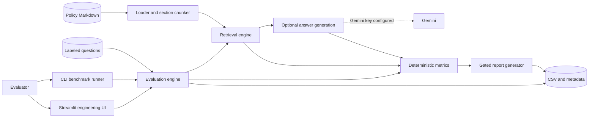

# Architecture

## System purpose

FinGenEval is an offline evaluation harness for financial RAG configurations. Evaluators use either the Streamlit engineering UI or the CLI to run labeled policy questions through retrieval configurations, optionally generate answers with Gemini, calculate deterministic metrics, and produce gated validation artifacts.

It does not serve end-user questions and does not execute agents or tools.

## Supported system

## Component ownership

| Component | Source | Responsibility |
|---|---|---|
| Streamlit interface | `app.py` | Inspect queries, compare retrieval, run benchmarks, display and download reports |
| Evaluation engine | `src/evaluator.py` | Load labeled questions, warm configurations, execute rows, time stages, resume successful generation, and save artifacts |
| Document ingestion | `src/document_loader.py`, `src/chunking.py` | Load Markdown deterministically and create provenance-preserving section chunks |
| Retrieval | `src/retrievers.py` | BM25, vector, hybrid, and reranked search over shared chunks |
| Generation | `src/llm.py` | Construct grounded prompts, call Gemini when configured, enforce rate limits, and expose retrieval-only/error modes |
| Metrics | `src/metrics.py` | Pure retrieval, grounding, citation, hallucination, abstention, and correctness proxy functions |
| Reporting | `src/report_generator.py` | Aggregate measured rows, apply configured gates, and emit Markdown |
| Configuration | `src/settings.py` | Paths, model identifiers, retrieval weights, rate limits, and deployment thresholds |

## Data flow

1. The evaluator selects retrieval methods, prompt styles, and top-k.
2. The harness loads 45 labeled questions and validates the required columns.
3. Seven synthetic policy documents are loaded and split into provenance-preserving section chunks.
4. Retrieval configurations are warmed before timed evaluation.
5. Every question/configuration combination retrieves evidence and records retrieval latency.
6. With no Gemini key, the row is explicitly retrieval-only. With a key, generation is attempted and failures are recorded rather than scored.
7. Retrieval metrics are always computed for answerable rows. Answer metrics are computed only for successful LLM rows.
8. The report generator aggregates measured rows and applies deterministic thresholds.
9. The CLI can persist `evaluation_results.csv`, `run_metadata.json`, and `governance_report.md` together.

## Reproducibility controls

- Input documents and questions are repository files.
- Dataset metadata includes a content fingerprint.
- Retrieval indexes are reused within a run and warmed before timing.
- Retrieval and generation latency are measured separately.
- Rate-limit waiting is excluded from generation latency.
- Failed or retrieval-only rows have empty answer-level metrics.
- Reports are generated from computed data rather than an LLM narrative.

## Experimental prototype boundary

The repository also retains `src/enterprise/`, `frontend/`, and migrations from an experimental local governance workflow. That prototype is not the supported FinGenEval architecture, is not a multi-agent product, and must not be described as a production deployment. Its deterministic helper functions and local adapters may inform future design only after an explicit scope decision.

## Trust boundaries and limitations

Documents, labels, generated answers, and hosted-model responses are untrusted inputs. The harness avoids autonomous side effects and produces evaluation evidence for human review.

The bundled corpus is synthetic and small. Lexical answer metrics cannot reliably detect all negation, entailment, or paraphrase errors. No production-scale, security, or regulatory claim follows from a passing local report.
