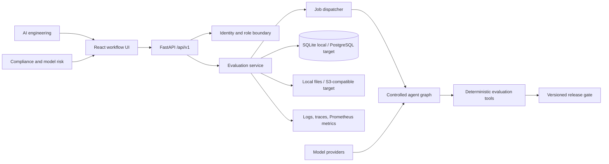
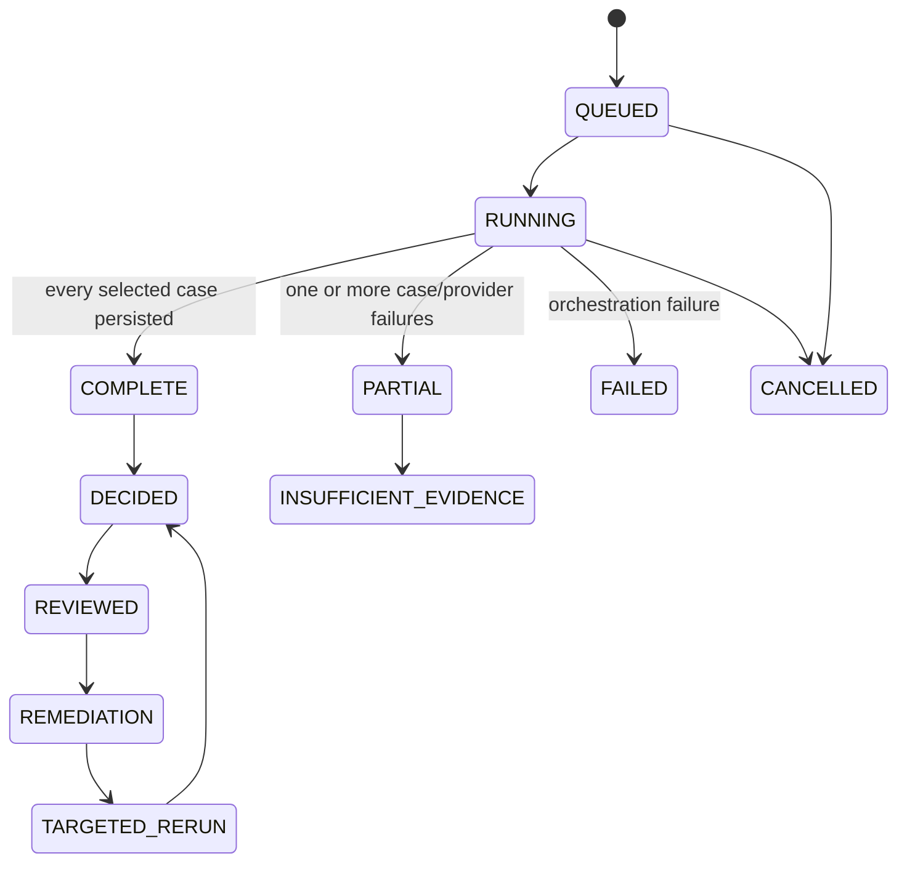

# Architecture

## System context

FinGenEval Enterprise sits between a financial institution's AI delivery team and its release authority. Engineers register immutable baseline and candidate configurations. Evaluators run an approved, versioned dataset. Compliance and business reviewers inspect evidence, review findings, and record decisions. The platform does not serve customer questions and does not make legal or regulatory determinations.

## Components and rationale

| Component | Local implementation | Production mapping |
|---|---|---|
| Workflow UI | React, TypeScript, Vite | Static assets behind CDN/WAF |
| API | FastAPI/Pydantic | Containers behind an authenticated load balancer |
| Persistence | SQLAlchemy + SQLite | PostgreSQL with backups, encryption, and row-level security |
| Execution | Eager or local thread pool | Durable queue such as Temporal, Celery, or managed workflow service |
| Reports | Local object-storage adapter | Versioned S3-compatible storage with retention controls |
| Providers | Retrieval-grounded deterministic local adapter | Approved model endpoints through private networking where available |
| Retrieval | Shared document loader, section chunker, and BM25 index | Swappable vector store and document service |
| Observability | JSON logs, correlation/run IDs, agent traces, metrics endpoint | OpenTelemetry collector, managed metrics/logs/traces, SIEM export |

## Domain and ownership

Every persistent aggregate belongs to a tenant. A project owns registered system versions, dataset versions, release policies, and runs. A run binds one immutable baseline, candidate, dataset, and policy. Case results create findings; findings own remediations; a run owns one computed release decision. Human approvals append to a decision and never rewrite its computed outcome. Reports reference a run and store a content digest.

Prompt, retrieval, model, data-source, dataset, policy, and document versions are separate entities so a reviewer can identify exactly what changed. The first vertical slice registers synthetic documents and versions, then persists evidence identifiers rather than copying policy text into result rows. Production ingestion still needs upload/connectors, parser isolation, entitlement synchronization, and authoring APIs.

## Evaluation lifecycle

Only `COMPLETE` runs can produce `PASS`, `PASS WITH CONDITIONS`, or `BLOCK`. A `PARTIAL`, `FAILED`, or `CANCELLED` run produces `INSUFFICIENT EVIDENCE`. This prevents partial provider output from being presented as a valid comparison.

## Controlled agent workflow

The workflow is an explicit acyclic graph with no recursive delegation:

1. Intake and Scoping validates intended use, prohibited use, ownership, and initial risk.
2. Test Design can draft source-grounded cases; every output is `DRAFT` and requires human approval.
3. Evaluation Orchestrator executes baseline/candidate calls and deterministic tools with per-case error isolation.
4. Evidence Verification returns claim assertions, evidence identifiers, citation status, and unsupported numeric/deadline claims.
5. Risk and Governance summarizes findings and required reviewers. Its recommendation is advisory.
6. Failure Investigation returns a likely stage, confidence, evidence, remediation, draft ticket, and rerun cases.
7. Handoff builds open-risk, monitoring, ownership, rollback, and scaling content for the final report.

Pydantic validates every output before persistence. Each step has a five-second local timeout, one retry, and a persisted attempt trace. The release gate is a separate pure function.

## Data flow and trust boundaries

1. An authenticated tenant user calls the API; the API resolves identity and role.
2. Tenant ID comes from the trusted identity record, never from request payloads.
3. The service loads only tenant-owned project/version/dataset/policy rows.
4. Workers restrict retrieval to the case's approved source documents and query the shared BM25 index.
5. The local provider records retrieved evidence and generates a deterministic baseline/candidate response; a production adapter can replace generation.
6. Deterministic checks compare the two responses and validate assertions/citations.
7. Case results and errors commit before the decision is computed.
8. Policy results list each triggered rule and evidence identifier.
9. Authorized human actions append approval and audit rows.

Untrusted boundaries are the browser, uploads, model providers, source documents, generated output, webhooks, and future tools. Database, audit, and policy services remain inside the protected application boundary.

## Scaling and reliability

- Partition jobs by tenant/run; use idempotency keys and case-result uniqueness to prevent duplicates.
- Lease cases to horizontally scaled workers, heartbeat long tasks, and recover abandoned leases.
- Apply provider-specific concurrency/rate limits, jittered retries, circuit breakers, and budgets.
- Batch embedding/inference where provider semantics permit and cache only content-addressed, tenant-scoped artifacts.
- Stream progress from persisted state so reconnecting clients do not depend on worker memory.
- Store document, prompt, model, policy, and code-image versions with each run for reproducibility.
- Use PostgreSQL read replicas only for reporting; decisions and approvals require the primary transactional path.
- Retain audit events append-only and export signed digests to an independent security account.

The repository includes a small k6 readiness smoke test but makes no tested-scale claim.
